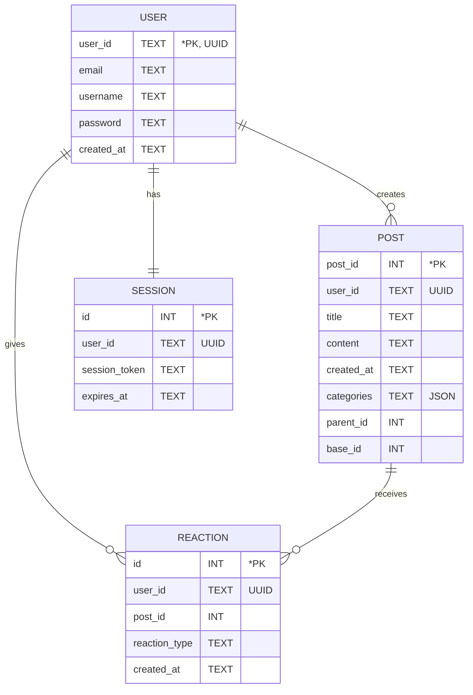

# Forum

A simple forum using SQLite and Go.
<...>

<!-- ### Installing gcc on Windows

Here's a good tutorial:
https://code.visualstudio.com/docs/cpp/config-mingw
 -->

## Installation

1. Make sure the following are installed in your sytem before running the program:
- Go (version 1.20 or later recommended)
- Git, such as Gitea, to clone the repository

2. Clone the repository by running the following code:
<...>

## Usage

You can now use the application by running the following command:
<...>

## Implementation

Following is an entity relationship diagram (ERD) showing the relationships among entities with their corresponding attributes:

## Members
<...>