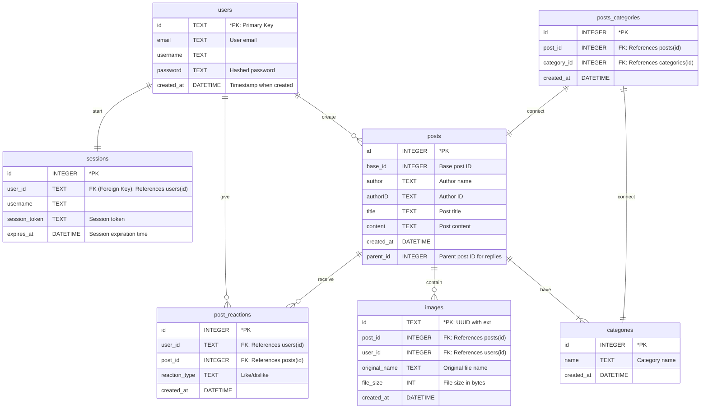

# Forum

The **grit:lab Fika Café** is simple yet functional web forum built with Go, HTML, CSS, JavaScript, and SQLite. This forum enables user communication through posts (threads), comments (replies), and likes/dislikes (reactions). Addutionally, it supports user authentication with password encryption and provides robust filtering. The project is containerized using Docker for portability and ease of deployment.

## Features

- **User Authentication**
  - Guests/unauthenticated users can only view the site.
  - Users can register with unique email, unique username, and password.
  - Registered users can log in to start a thread and reply and react to posts.
  - Passwords are encrypted using [bcrypt](https://pkg.go.dev/golang.org/x/crypto/bcrypt) when stored.
- **Sessions and Cookies**
  - A unique session token ([UUID](https://github.com/gofrs/uuid)) is created for every successful login.
  - A session auto-expires every 30 minutes.
  - A user can start only one session at a time.
- **Forum Functionality**
  - Create, view, reply, and react to threads.
  - Add one or more categories to posts.
  - Like or dislike (but not do both to) a post.
  - See the number of comments to a thread and number of reactions to a post.
  - Filter posts that match any or all provided categories.
  - Show posts that the logged-in user has created, liked, or disliked.
  - Add optional images to a new thread.
- **Web development**
  - HTTP status codes are explicitly handled for different scenarios, such as the following:
    - successful log in redirects to home (303)
    - invalid/empty input in text field (400)
    - invalid URL (404)
    - invalid HTTP method (405)
    - error querying database (500)
  - Light and dark modes can be toggled.
  - Web design is responsive, consistent, and interactive.
- **Database**
  - [SQLite](https://www.sqlite.org/index.html) has been used for a stable and lightweight database engine.
  - The [go-sqlite3](https://github.com/mattn/go-sqlite3) driver was used.
  - An [entity-relationship diagram (ERD)](#erd) is provided subsequently.
- **Deployment**
  - Docker containerization enables smooth and consistent deployment.
  - A script to build the Docker image and container, as well as prune unused objects, has been provided for ease of use.

## ERD

Based on the project's database schema, the following is an ERD showing the relationships among entities and their attributes:



## Installation

### Prerequisites

Make sure the following are installed in your sytem before running the program:
- Go (version 1.20 or later recommended)
- Git, such as Gitea, to clone the repository

### Steps

1. Clone the repository:
   ```bash
   git clone https://01.gritlab.ax/git/obalandi/forum.git
   ```
2. Navigate to the project directory:
   ```bash
   cd forum
   ```
3. Run the Go application:
   ```bash
   go run main.go
   ```

## Docker Instructions

### Prerequisites

Make sure [Docker](https://docs.docker.com/get-started/get-docker/) is installed in your sytem.

### Steps

****Option 1****

Run the script to automate the process:

```bash
bash script.sh
```

****Option 2****

Manually build the image and run the container:

1. Build the Docker image, replacing `<image_name>` with your preferred name:

```bash
docker image build -f Dockerfile -t <image_name> .
```

2. Run the Docker container, replacing `<port>`, `<container_name>`, and `<image_name>` with your preference:

```bash
docker container run -p <port> --detach --name <container_name> <image_name>
```

Finally, open your browser and navigate to `http://localhost:8080` to see the app in action!


## Members

- [Markus](https://github.com/MarkusYPA)
- [Jedi](https://github.com/jeeeeedi)
- [Anastasia](https://github.com/An1Su)
- [Chan](https://github.com/cmbigk)
- [Oleg](https://github.com/olegamobile)
