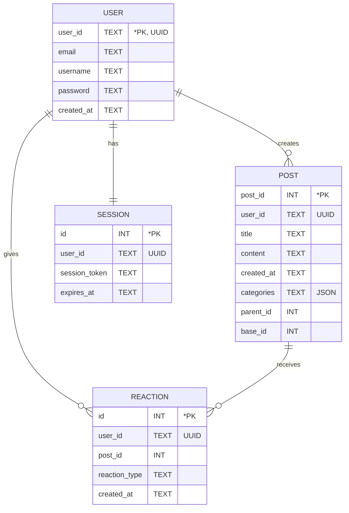

# Forum

A simple yet functional web forum built with Go and SQLite. This forum enables user communication through posts and comments, supports user authentication, and provides a robust filter mechanism. The project is containerized using Docker for portability and ease of deployment.

## Features

- **User Authentication**  
  - Register with email, username, and password.  
  - Login with session management using cookies.  
  - Encrypted password storage (Bonus).  
- **Forum Functionality**  
  - Create, view, and reply to threads.  
  - Associate categories with posts.  
  - View and add likes/dislikes to posts and comments.  
  - Filter posts by categories, created posts, or liked posts.  
  - Dark mode toggle and responsive design.  
- **Accessibility**  
  - Non-registered users can view posts and comments.  
- **Database**  
  - SQLite for data persistence with efficient query handling.  
- **Deployment**  
  - Docker containerization for smooth deployment.  

## Objectives

The forum enables:  
1. Communication between users through posts and comments.  
2. Filtering posts by categories, created posts, or liked posts.  
3. Authentication with secure user registration and login.  
4. Persistent storage using SQLite.  

The forum ensures:  
- Proper error handling (HTTP status and technical errors).  
- Secure practices like session management with cookies and password encryption (Bonus).  
- Compliance with good coding practices.  
- Use of SQL queries (`SELECT`, `CREATE`, `INSERT`).  

## Entity-Relationship Diagram (ERD)

The relationships among entities and their attributes are shown below:



## Installation

1. Clone the repository:
   ```bash
   git clone https://01.gritlab.ax/git/obalandi/forum.git
   ```
2. Navigate to the project directory:
   ```bash
   cd forum
   ```
3. Run the Go application:
   ```bash
   go run main.go
   ```


## Docker Instructions

1. Build the Docker Image
```bash
docker build -t forum .
```
2. Run the Docker Container
```bash
docker run -p 8080:8080 forum
```

- Open your browser and navigate to `http://localhost:8080` to see the app in action!


## Learnings
**This project demonstrates:**
1. Basics of web development (HTML, HTTP, sessions, cookies).
2. SQL language and database manipulation using SQLite.
3. Containerization and deployment with Docker.
4. Secure practices like encryption and session management.


## Authors

- Markus 
- Jedi
- Anastasia
- Chan
- Oleg 


## License

This project is open-source and available under the MIT License. See the [LICENSE](LICENSE) file for more information.

---